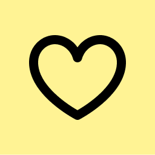
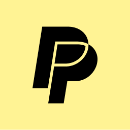
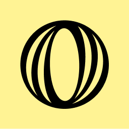

<p align="center"></p>
<h1 align="center">SEXYREAD</h1>
<p align="center">Lorem ipsum dolor sit amet, consectetur adipiscing elit. Morbi urna turpis, placerat quis semper sed, dignissim vel dui. Aliquam luctus vel ante et sollicitudin. Nullam sapien tortor, elementum vitae orci a, ullamcorper luctus purus. Sed dignissim elementum eleifend. Aenean vestibulum nisi non elit cursus, non rutrum augue finibus.</p>

<hr>
  <p align="center"><a href="#"></a><a href="#"></a><a href="#"></a><a href="#"></a></p>
<hr>

### Template Preview

<p></p>
<p></p>


<div align="center">
<p></p>
<h1>SEXYREAD</h1><br>
</div>

<table>
  <tr>
    <td align="center" width="9999">
    <p>Lorem ipsum dolor sit amet, consectetur adipiscing elit. Morbi urna turpis, placerat quis semper sed, dignissim vel dui. Aliquam luctus vel ante et sollicitudin. Nullam sapien tortor, elementum vitae orci a, ullamcorper luctus purus. Sed dignissim elementum eleifend. Aenean vestibulum nisi non elit cursus, non rutrum augue finibus.</p>
    </td>
  </tr>
</table>

### Template Preview

<p></p>
<p></p>


[//]: # (<hr>)

[//]: # ()
[//]: # (# SEXYREAD)

[//]: # ()
[//]: # (Lorem ipsum dolor sit amet, consectetur adipiscing elit. Morbi urna turpis, placerat quis semper sed, dignissim vel dui. Aliquam luctus vel ante et sollicitudin. Nullam sapien tortor, elementum vitae orci a, ullamcorper luctus purus. Sed dignissim elementum eleifend. Aenean vestibulum nisi non elit cursus, non rutrum augue finibus.)

[//]: # ()
[//]: # (### Mobile Preview)

[//]: # ()
[//]: # (<p></p>)

[//]: # ()
[//]: # (Lorem ipsum dolor sit amet, consectetur adipiscing elit, sed do eiusmod tempor incididunt ut labore et dolore magna aliqua. Ut enim ad minim veniam, quis nostrud exercitation ullamco laboris nisi ut aliquip ex ea commodo consequat.)

[//]: # ()
[//]: # (### Add PyPI Package)

[//]: # ()
[//]: # (```shell)

[//]: # (poetry add git+https://github.com/olankens/hisenser.git)

[//]: # (```)

[//]: # ()
[//]: # (### Modify Picture Mode)

[//]: # ()
[//]: # (```python)

[//]: # (with &#40;client := Client&#40;input&#40;"enter television ip address: "&#41;.strip&#40;&#41;, foolish=True, secured=True&#41;&#41;:)

[//]: # (    if not client.attach&#40;&#41;:)

[//]: # (        client.permit&#40;input&#40;"enter television pairing code: "&#41;.strip&#40;&#41;&#41;)

[//]: # (    client.change_picture_mode&#40;PictureMode.CINEMA_NIGHT&#41;)

[//]: # (    client.revert_picture_mode&#40;&#41;)

[//]: # (    client.change_apply_picture&#40;ApplyPicture.ALL&#41;)

[//]: # (    client.change_local_dimming&#40;LocalDimming.MEDIUM&#41;)

[//]: # (    client.change_backlight&#40;40&#41;)

[//]: # (    client.change_brightness&#40;50&#41;)

[//]: # (    client.change_contrast&#40;75&#41;)

[//]: # (    client.change_color_saturation&#40;50&#41;)

[//]: # (    client.change_sharpness&#40;10&#41;)

[//]: # (    client.change_adaptive_contrast&#40;AdaptiveContrast.OFF&#41;)

[//]: # (    client.change_ultra_smooth_motion&#40;UltraSmoothMotion.OFF&#41;)

[//]: # (    client.change_noise_reduction&#40;NoiseReduction.OFF&#41;)

[//]: # (    client.change_color_temperature&#40;ColorTemperature.WARM1&#41;)

[//]: # (    client.change_color_gamut&#40;ColorGamut.NATIVE&#41;)

[//]: # (    client.change_gamma_adjustment&#40;GammaAdjustment.GAMMA_2_2&#41;)

[//]: # (    client.toggle_viewing_angle&#40;&#41;)

[//]: # (```)

[//]: # (<table><tr><td align="center" width="9999">)

[//]: # (  &nbsp;)

[//]: # (  <p></p>)

[//]: # (  &nbsp;)

[//]: # (</td></tr></table>)

[//]: # (<div align="center">)

[//]: # (  <p></p>)

[//]: # (  <h1>SEXYREAD</h1>)

[//]: # (</div>)

[//]: # (<table>)

[//]: # (  <tr>)

[//]: # (    <td align="center" width="9999">)

[//]: # (      &nbsp;<p></p>)

[//]: # (      <h1>SEXYREAD</h1>)

[//]: # (      &nbsp;<p>Lorem ipsum dolor sit amet, consectetur adipiscing elit. Morbi urna turpis, placerat quis semper sed, dignissim vel dui. Aliquam luctus vel ante et sollicitudin. Nullam sapien tortor, elementum vitae orci a, ullamcorper luctus purus. Sed dignissim elementum eleifend. Aenean vestibulum nisi non elit cursus, non rutrum augue finibus.</p>&nbsp;)

[//]: # (    </td>)

[//]: # (  </tr>)

[//]: # (  <tr><td align="center" width="9999">)

[//]: # (    <p align="center">)

[//]: # (    <picture><source srcset="res/stack-github-sponsors-dark.png" media="&#40;prefers-color-scheme: dark&#41;"></picture>&nbsp;&nbsp;&nbsp;)

[//]: # (    <picture><source srcset="res/stack-paypal-dark.png" media="&#40;prefers-color-scheme: dark&#41;"></picture>&nbsp;&nbsp;&nbsp;)

[//]: # (    <picture><source srcset="res/stack-kofi-dark.png" media="&#40;prefers-color-scheme: dark&#41;"></picture>)

[//]: # (    </p>)

[//]: # (  </td></tr>)

[//]: # (</table>)

[//]: # (<table>)

[//]: # (  <tr>)

[//]: # (    <td align="center" width="9999">)

[//]: # (      <p>Lorem ipsum dolor sit amet, consectetur adipiscing elit. Morbi urna turpis, placerat quis semper sed, dignissim vel dui. Aliquam luctus vel ante et sollicitudin. Nullam sapien tortor, elementum vitae orci a, ullamcorper luctus purus. Sed dignissim elementum eleifend. Aenean vestibulum nisi non elit cursus, non rutrum augue finibus.</p>)

[//]: # (    </td>)

[//]: # (  </tr>)

[//]: # (</table>)

[//]: # (<table>)

[//]: # (  <tr>)

[//]: # (    <td align="center">)

[//]: # (      &nbsp;)

[//]: # (      <p></p>)

[//]: # (      <h1>SEXYREAD</h1>)

[//]: # (      <p align="center">Lorem ipsum dolor sit amet, consectetur adipiscing elit. Morbi urna turpis, placerat quis semper sed, dignissim vel dui. Aliquam luctus vel ante et sollicitudin. Nullam sapien tortor, elementum vitae orci a, ullamcorper luctus purus. Sed dignissim elementum eleifend. Aenean vestibulum nisi non elit cursus, non rutrum augue finibus.</p>)

[//]: # (      &nbsp;)

[//]: # (    </td>)

[//]: # (  </tr>)

[//]: # (</table>)

[//]: # (<h1 align="center">SEXYREAD</h1>)

[//]: # (<p align="center"><mark>Lorem ipsum dolor sit amet, consectetur adipiscing elit. Morbi urna turpis, placerat quis semper sed, dignissim vel dui. Aliquam luctus vel ante et sollicitudin. Nullam sapien tortor, elementum vitae orci a, ullamcorper luctus purus. Sed dignissim elementum eleifend. Aenean vestibulum nisi non elit cursus, non rutrum augue finibus.</mark></p>)

[//]: # (<table><tr><td align="center" width="9999">)

[//]: # (  <p align="center">)

[//]: # (  <picture><source srcset="res/stack-github-sponsors-dark.png" media="&#40;prefers-color-scheme: dark&#41;"></picture>&nbsp;&nbsp;&nbsp;)

[//]: # (  <picture><source srcset="res/stack-paypal-dark.png" media="&#40;prefers-color-scheme: dark&#41;"></picture>&nbsp;&nbsp;&nbsp;)

[//]: # (  <picture><source srcset="res/stack-kofi-dark.png" media="&#40;prefers-color-scheme: dark&#41;"></picture>)

[//]: # (  </p>)

[//]: # (</td></tr></table>)

[//]: # (<table>)

[//]: # (  <tr>)

[//]: # (    <td align="center" width="9999"><a href="#"></a></td>)

[//]: # (    <td align="center" width="9999"><a href="#"></a></td>)

[//]: # (    <td align="center" width="9999"><a href="#"></a></td>)

[//]: # (    <td align="center" width="9999"><a href="#"></a></td>)

[//]: # (  </tr>)

[//]: # (</table>)

[//]: # (### Full-Width Preview)

[//]: # ()
[//]: # (<p></p>)

[//]: # ()
[//]: # (### Mobile Preview)

[//]: # ()
[//]: # (<p></p>)

[//]: # (<p></p>)

[//]: # ()
[//]: # (### Instruction)

[//]: # ()
[//]: # (```python)

[//]: # (with &#40;client := Client&#40;input&#40;"enter television ip address: "&#41;.strip&#40;&#41;, foolish=True, secured=True&#41;&#41;:)

[//]: # (    if not client.attach&#40;&#41;:)

[//]: # (        client.permit&#40;input&#40;"enter television pairing code: "&#41;.strip&#40;&#41;&#41;)

[//]: # (    client.change_picture_mode&#40;PictureMode.CINEMA_NIGHT&#41;)

[//]: # (    client.revert_picture_mode&#40;&#41;)

[//]: # (    client.change_apply_picture&#40;ApplyPicture.ALL&#41;)

[//]: # (    client.change_local_dimming&#40;LocalDimming.MEDIUM&#41;)

[//]: # (    client.change_backlight&#40;40&#41;)

[//]: # (    client.change_brightness&#40;50&#41;)

[//]: # (    client.change_contrast&#40;75&#41;)

[//]: # (    client.change_color_saturation&#40;50&#41;)

[//]: # (    client.change_sharpness&#40;10&#41;)

[//]: # (    client.change_adaptive_contrast&#40;AdaptiveContrast.OFF&#41;)

[//]: # (    client.change_ultra_smooth_motion&#40;UltraSmoothMotion.OFF&#41;)

[//]: # (    client.change_noise_reduction&#40;NoiseReduction.OFF&#41;)

[//]: # (    client.change_color_temperature&#40;ColorTemperature.WARM1&#41;)

[//]: # (    client.change_color_gamut&#40;ColorGamut.NATIVE&#41;)

[//]: # (    client.change_gamma_adjustment&#40;GammaAdjustment.GAMMA_2_2&#41;)

[//]: # (    client.toggle_viewing_angle&#40;&#41;)

[//]: # (```)

[//]: # ()
[//]: # (### Contributors)

[//]: # ()
[//]: # (<p></p>)

[//]: # (<p></p>)

[//]: # (<p></p>)
