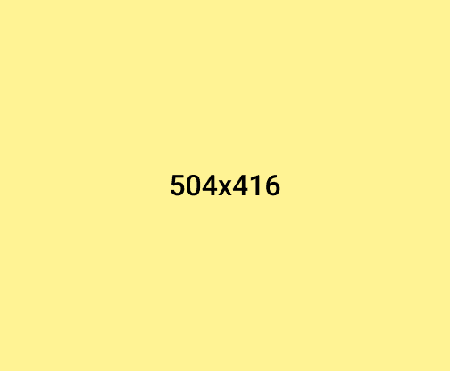
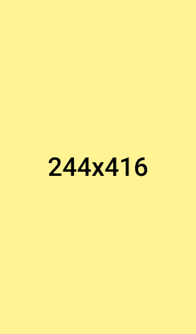
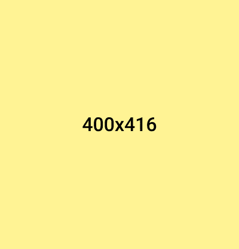
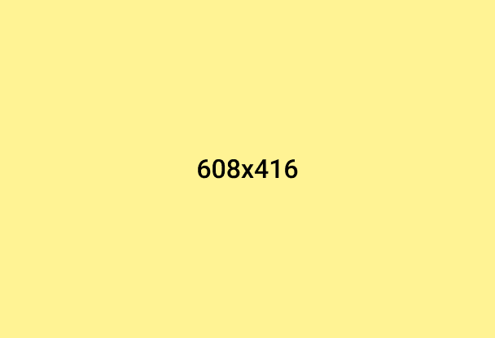
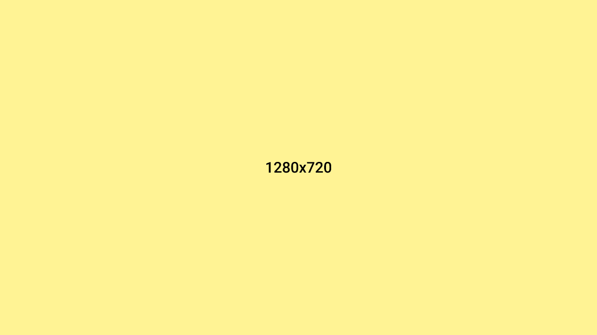

  

  <h1>SEXYREAD</h1>
  
Lorem ipsum dolor sit amet, consectetur adipiscing elit. Morbi urna turpis, placerat quis semper sed, dignissim vel dui. Aliquam luctus vel ante et sollicitudin. Nullam sapien tortor, elementum vitae orci a, ullamcorper luctus purus. Sed dignissim elementum eleifend. Aenean vestibulum nisi non elit cursus, non rutrum augue finibus.

### 1x1-Column Section

### 1z2-Column Section

### 1x4-Column Section

### 1x6-Column Section

### 1x4-Column Section

### 1x3-Column Section

### 2x3-Table Section

<table>
  <tbody><tr>
    <td align="center" width="9999"></td>
    <td align="center" width="9999"></td>
    <td align="center" width="9999"></td>
  </tr></tbody>
  <tbody><tr>
    <td align="center" width="9999"></td>
    <td align="center" width="9999"></td>
    <td align="center" width="9999"></td>
  </tr></tbody>
</table>

### 2x4-Table Section

<table>
  <tbody><tr>
    <td align="center" width="9999"></td>
    <td align="center" width="9999"></td>
    <td align="center" width="9999"></td>
    <td align="center" width="9999"></td>
  </tr></tbody>
  <tbody><tr>
    <td align="center"></td>
    <td align="center"></td>
    <td align="center"></td>
    <td align="center"></td>
  </tr></tbody>
</table>

### 2x5-Table Section

<table>
  <tbody><tr>
    <td align="center" width="9999">
      &nbsp;
<a href="#"><picture><source media="(prefers-color-scheme: dark)" srcset="res/stack-square-dark.png"></picture></a>
&nbsp;
    </td>
    <td align="center" width="9999">
      &nbsp;
<a href="#"><picture><source media="(prefers-color-scheme: dark)" srcset="res/stack-square-dark.png"></picture></a>
&nbsp;
    </td>
    <td align="center" width="9999">
      &nbsp;
<a href="#"><picture><source media="(prefers-color-scheme: dark)" srcset="res/stack-square-dark.png"></picture></a>
&nbsp;
    </td>
    <td align="center" width="9999">
      &nbsp;
<a href="#"><picture><source media="(prefers-color-scheme: dark)" srcset="res/stack-square-dark.png"></picture></a>
&nbsp;
    </td>
    <td align="center" width="9999">
      &nbsp;
<a href="#"><picture><source media="(prefers-color-scheme: dark)" srcset="res/stack-square-dark.png"></picture></a>
&nbsp;
    </td>
  </tr></tbody>
  <tbody><tr>
    <td align="center" width="9999">
      &nbsp;
<a href="#"><picture><source media="(prefers-color-scheme: dark)" srcset="res/stack-square-dark.png"></picture></a>
&nbsp;
    </td>
    <td align="center" width="9999">
      &nbsp;
<a href="#"><picture><source media="(prefers-color-scheme: dark)" srcset="res/stack-square-dark.png"></picture></a>
&nbsp;
    </td>
    <td align="center" width="9999">
      &nbsp;
<a href="#"><picture><source media="(prefers-color-scheme: dark)" srcset="res/stack-square-dark.png"></picture></a>
&nbsp;
    </td>
    <td align="center" width="9999">
      &nbsp;
<a href="#"><picture><source media="(prefers-color-scheme: dark)" srcset="res/stack-square-dark.png"></picture></a>
&nbsp;
    </td>
    <td align="center" width="9999">
      &nbsp;
<a href="#"><picture><source media="(prefers-color-scheme: dark)" srcset="res/stack-square-dark.png"></picture></a>
&nbsp;
    </td>
  </tr></tbody>
</table>

### 1x3-Stack Section

  <a href="#"><picture><source media="(prefers-color-scheme: dark)" srcset="res/stack-square-dark.png"></picture></a>
  &nbsp;
  <a href="#"><picture><source media="(prefers-color-scheme: dark)" srcset="res/stack-circle-dark.png"></picture></a>
  &nbsp;
  <a href="#"><picture><source media="(prefers-color-scheme: dark)" srcset="res/stack-square-dark.png"></picture></a>

### 1x4-Stack Section

  <a href="#"><picture><source media="(prefers-color-scheme: dark)" srcset="res/stack-horizontal-dark.png"></picture></a>
  &nbsp;
  <a href="#"><picture><source media="(prefers-color-scheme: dark)" srcset="res/stack-square-dark.png"></picture></a>
  &nbsp;
  <a href="#"><picture><source media="(prefers-color-scheme: dark)" srcset="res/stack-vertical-dark.png"></picture></a>
  &nbsp;
  <a href="#"><picture><source media="(prefers-color-scheme: dark)" srcset="res/stack-circle-dark.png"></picture></a>

