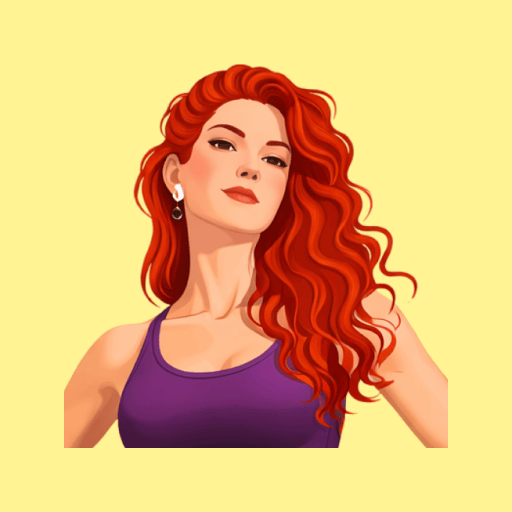
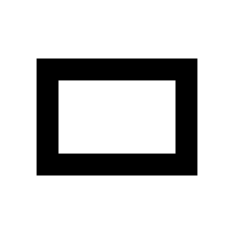
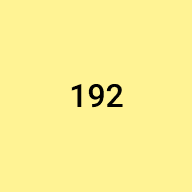

<h1 align="center">SEXYREAD</h1>

  Lorem ipsum dolor sit amet, consectetur adipiscing elit. Morbi urna turpis, placerat quis semper sed, dignissim vel dui. Aliquam luctus vel ante et sollicitudin. Nullam sapien tortor, elementum vitae orci a, ullamcorper luctus purus. Sed dignissim elementum eleifend. Aenean vestibulum nisi non elit cursus.

<table><tr><td align="center" height="80" width="9999">
  <a href="#"><picture><source media="(prefers-color-scheme: dark)" srcset="res/stack-horizontal-dark.png"></picture></a>
  <a href="#"><picture><source media="(prefers-color-scheme: dark)" srcset="res/stack-square-dark.png"></picture></a>
  <a href="#"><picture><source media="(prefers-color-scheme: dark)" srcset="res/stack-vertical-dark.png"></picture></a>
  <a href="#"><picture><source media="(prefers-color-scheme: dark)" srcset="res/stack-circle-dark.png"></picture></a>
</td></tr></table>

## Template Preview

<table>
  <tr><td align="center" width="9999">
    
  </td></tr>
  <tr><td align="center" width="9999">
    
  </td></tr>
</table>

## Template Preview 

<picture><source media="(prefers-color-scheme: dark)" srcset="res/1x1-dark.png"></picture>

[//]: # (### Template Preview &#40;2&#41;)

[//]: # ()
[//]: # (<table>)

[//]: # (  <tr align="center">)

[//]: # (    <td></td>)

[//]: # (    <td></td>)

[//]: # (    <td></td>)

[//]: # (    <td></td>)

[//]: # (  </tr>)

[//]: # (  <tr align="center">)

[//]: # (    <td></td>)

[//]: # (    <td></td>)

[//]: # (    <td></td>)

[//]: # (    <td></td>)

[//]: # (  </tr>)

[//]: # (</table>)

[//]: # ()
[//]: # (### Template Preview &#40;3&#41;)

[//]: # ()
[//]: # (
)

[//]: # (  )

[//]: # (  )

[//]: # (
)