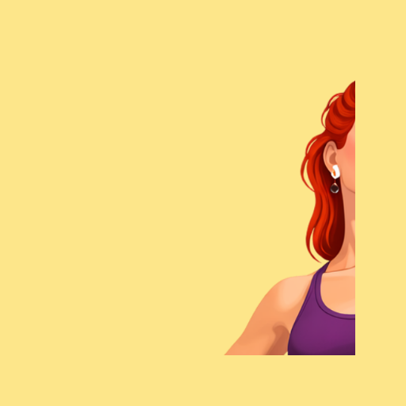

  <!--

-->
  

  <h1>SEXYREAD</h1>

<table><tr><td align="center" width="9999">
  &nbsp;

    <a href="#">Website</a> | <a href="#">Documentation</a> | <a href="#">Donate</a>
  
&nbsp;
</td></tr></table>

<table><tr><td align="center" width="9999">
  &nbsp;

    Technology logo pack intended for very seamless integration into README.md files or visual assets such as LinkedIn banners, provided in both dark and light variants for optimal flexibility and consistency.
  
&nbsp;
</td></tr></table>

### Feature List

#### 2x1 Feature Row

### Catalog List

#### For Backdrop List

### Tutorial List

#### One-Step Tutorial

#### Multi-Step Tutorial

### Module List

#### For Backend